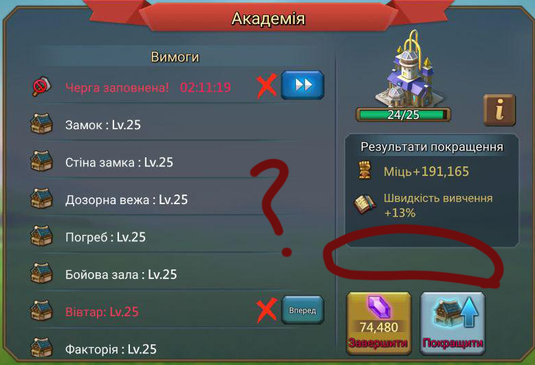
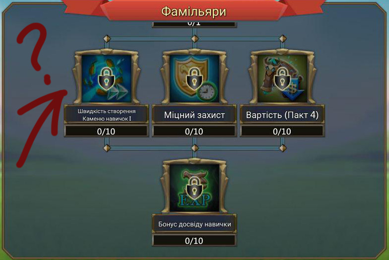
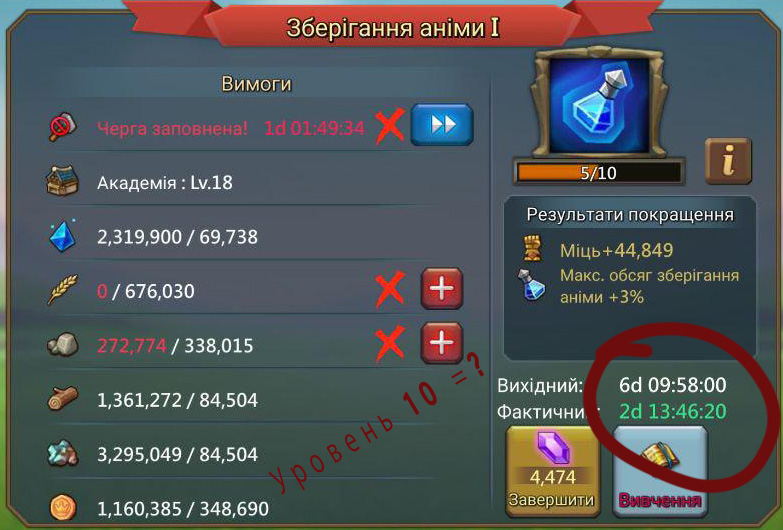
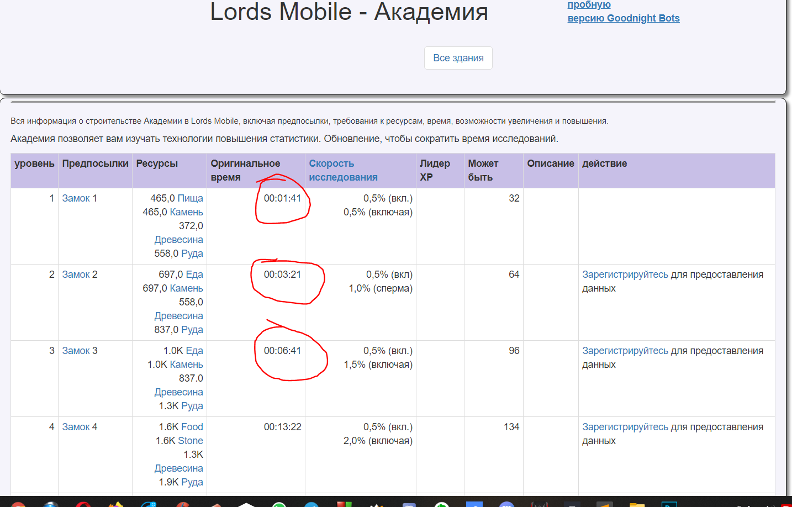
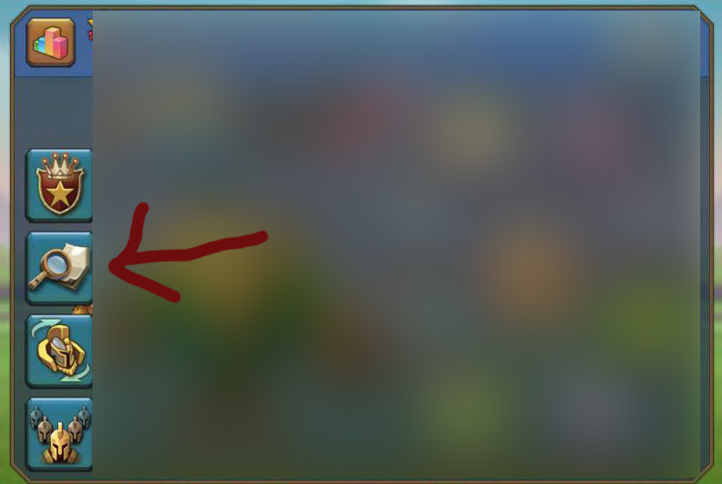
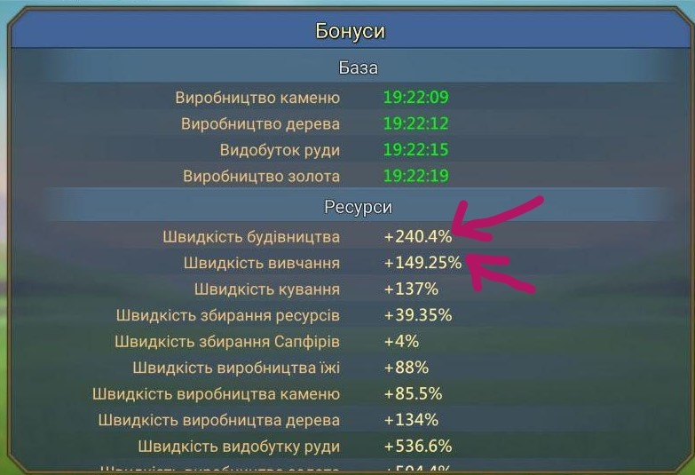

# Калькулятор времени Lords Mobile

Эта страница была разработана по запросу и для моих друзей.
Это позволит вам рассчитать конечное время, необходимое для выполнения задачи с определенным процентным увеличением скорости.

Посмотреть живую версию этого архива здесь  
-> https://codehack3r.github.io/Lords-Mobile-Time-Calculator-Russian

Проверьте мою страницу GitHub здесь
-> https://codehack3r.github.io

Посмотреть мой профиль github здесь.
-> https://github.com/codehack3r

Если вы не знаете, как пользоваться этим сайтом, прочитайте внимательно здесь.
--
Иногда вы хотите рассчитать точное время, необходимое для выполнения задачи, но игра сама по себе не показывает это.

Например:
 
Дело 1:
 

 
Дело 2:
 

 
Дело 3:
 

 
Есть и другие случаи.

Здесь игра не показывает детали времени. В таком случае вы можете использовать этот сайт. 
Для использования этого сайта вам необходимо 2 типа информации.
1. Оригинал время для выполнения задачи.
Вы можете искать в интернете. Есть сотни сайтов, чтобы сказать это.

Например:
  

  
2. Ваша скорость для этой задачи. Чтобы проверить процент ускорения, следуйте этому методу.
 
i. 
  

  
ii. 
  

  
iii. 
  

  
Теперь, после получения этой информации, просто заполните данные и нажмите «Рассчитать». Это все, что вам нужно сделать.
 
 
 
Ключевое слово:
 
Lords Mobile
 
Калькулятор времени Lords Mobile
 
Калькулятор скорости  lords mobile
 
Исследовательский калькулятор lords mobile
 
Строительный калькулятор lords mobile
 
Калькулятор времени обучения войск lords mobile
